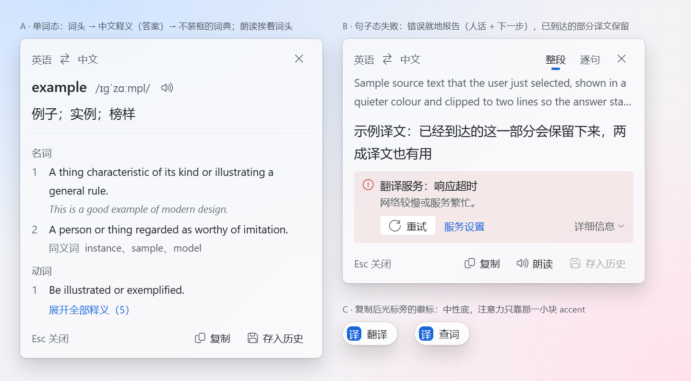
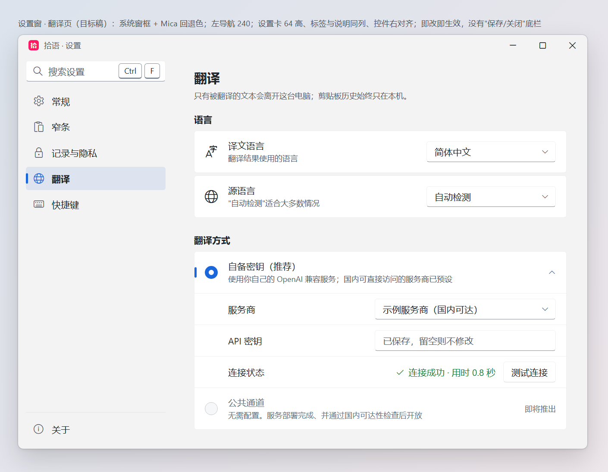

# 拾语 · CTO 评审（三）：UI 设计评审与目标设计

> 日期：2026-10-01 ｜ 评审对象：`master @ db93a74`
> 视角：产品设计师（Windows 11 Fluent、中文排版、效率工具/剪贴板管理器）
> 配套：《判断报告》[2026-10-01-cto-assessment.md](2026-10-01-cto-assessment.md) ·
> 《优化报告》[2026-10-01-optimization-plan.md](2026-10-01-optimization-plan.md)
>
> **证据**：15 张真机截图（双屏，4K@150% + 2K@100%），对截图逐像素取样（PowerShell/System.Drawing、ImageMagick）；
> 文中的色值、尺寸凡标"实测"都来自取样，不是目测。对比度按 WCAG 2.x 公式计算。
> 截图含个人数据，**留在仓库外**。
> **隐私**：本文只描述版式、结构与视觉，不转录任何剪贴板内容、路径或历史文本。
> 单位：DIP（设备无关像素）。150% 缩放下，1 DIP = 1.5 物理像素。

---

## 0. 结论

**一句话：骨架对，表层粗。底层架构是 7 分水平，表层执行是 3 分水平。**
问题不在于设计没想清楚，而在于"控件只换色、不换模板"这一个捷径，把很多好决策挡在了用户看得见的那一层之外。

拾语有几件真正好的设计资产：光标旁出现、不抢焦点的浮层；按住 Ctrl 就地显示的键帽；中文正文 18 DIP、行高 1.7，按整数行截断；"设置即数据"加搜索加深链。
它们被三类表层问题拖累：

1. **七个共性根因**（§2）。其中两个最关键：
   - 一条 App 级的隐式 `TextBlock` 样式，一处同时造成了标题栏字形变豆腐块、删除钮危险色失效、选中分段对比度只有 3.0:1。
   - 控件只换色不换模板，于是窄条的标签框、翻译面板的 6 枚按钮、快速条的列表、管理窗与设置窗的大部分控件，都还是 Win7 时代的 Aero2 外观。
2. **浮层家族没有统一规格**（§3、§4.7）。六个浮层有六套圆角、内边距、字号和"选中"表达。四扇窗出现双轮廓、双圆角：DWM 画了 8 DIP，WPF 又画了 12 DIP。
3. **常规窗像开发者工具**（§3.8、§3.9）：
   - 管理窗：底部 13 个等权文字按钮，两组按钮挤在同一行并且已经相撞；零键盘支持。
   - 设置窗：值的字号比标签小；标签被截断；数值没有单位；关闭时静默丢弃改动；公共通道的隐私告知在界面上根本不显示。

**怎么改，三步走：**

1. **先修根因，一次消掉十几个症状。** 删掉隐式 `TextBlock` 样式里的颜色和字体，改在窗口根设置；重写按钮、输入框、列表项模板（或接入 .NET 9 自带的 Fluent 主题字典，见 §4.8）。
2. **浮层家族统一成一套外壳**：8 DIP 圆角交给 DWM；零 Aero2；"选中"只用一种表达；命中区 32、字形 16。
3. **常规窗改走系统窗框、设置卡和命令栏**，并把窄条的键盘模型延伸到管理窗。

**北极星：复制过的、看不懂的，都在光标旁：一眼认出，一键拿回，用完即散。**（三条原则见 §6 开头）

**需要你拍板的七件事**（§7.3）：
1. 控件文字回到 Fluent 的 14，还是维持 16；
2. 卡片圆角用 4 还是 8；
3. 快速条是否并入窄条；
4. 双击统一为"粘贴"；
5. "只看收藏"用哪个键；
6. 单词态的朗读改为读原词；
7. 引导里翻译方式的默认项（取决于判断报告 §7 第 1 项）。

---

## 1. 设计成熟度评分

> 按"用户每天实际看到的界面"加权：窄条和翻译面板每天用几十次，常规窗大约每周一次。括号里是两类界面的分差。

| 维度 | 分 | 依据 |
|---|---|---|
| 视觉一致性 | **3** | 窄条是圆角卡片、字形图标、下划线页签；常规窗是 Aero2 原生控件。同一产品里有两种按钮底色，代码里有 31 种按钮内边距，三种窗口外壳。 |
| 信息层级 | **4** | 窄条"元信息 → 正文"很清楚（7）。设置窗里值 12 < 说明 14 < 标签 15，层级倒置；管理窗 13 个文字按钮等权，没有主次（3）。 |
| 密度与留白 | **4** | 管理窗底部两行按钮墙过密，而且已经相撞；设置窗有些页上 1/3 拥挤、下 2/3 空白。间距每 2 px 一档，等于没有网格；代码里有 130 处手写 `Thickness`。 |
| 排版（含中文） | **5** | 中文意识是真加分：阅读行高 1.7，雅黑回退链，中英之间留空格。但字号两天内整体上调了四次；14/15/16 相邻档只差 1 DIP；详情栏的中文散文用了等宽字体。 |
| 色彩与对比 | **5** | 令牌成对出现、有 WCAG 自动测试，这样的底子少见。但测试被 `Opacity` 和隐式样式绕过（说明文字 3.5:1，选中分段 3.0:1）；输入框边界对比约 1.3:1，达不到非文本 3:1 的要求。 |
| 图标体系 | **5** | 窄条已经全面转向 Segoe Fluent Icons，并且有字形表（7）。常规窗几乎没有图标，标题栏三个按钮是豆腐块；全产品还混用了 15 处 emoji 或符号字符（2）。 |
| 动效 | **6** | `MotionPlan` 两档时长，并完整遵守系统"减少动画"，体系是对的。设置深链的三段衰减脉冲是有含义的动效。 |
| 交互可发现性 | **4** | 窄条有按住 Ctrl 显示键帽、首用提示、Esc 文案联动（8）。管理窗零快捷键；托盘菜单不显示快捷键；"接管 Win+V"藏在快捷键页的第三屏（2）。 |
| 可访问性 | **3** | 全代码 0 处 `FocusVisualStyle`，0 处 `AutomationProperties`；读屏软件读到标题栏按钮时会念出私有区字符；不跟随系统"文本大小"。 |
| 品牌感 | **4** | 粉色标识有浅深两版，是用心之作。但常规窗没有任何品牌元素，关于页连标识都没有；强调色蓝和品牌粉没有成体系。 |

**均分 4.3。** 浮层大约 5.5 分，常规窗大约 3 分。

---

## 2. 七个共性根因：先修根因，再修页面

票 30 修过一次 R1 的同根缺陷（托盘字形变豆腐块），但只修了那一处，于是票 33 的标题栏又原样复发。**只修症状就会反复复发。**

| # | 根因 | 代码位置 | 在截图上的症状 |
|---|---|---|---|
| R1 | **App 级隐式 `TextBlock` 样式强制设了 `FontFamily` 和 `Foreground`。** 这条样式会作用到按钮内容生成的 `TextBlock` 上，优先级高于从按钮继承下来的字体和颜色。 | `Themes/Controls.xaml:16-19` | 标题栏三个按钮全是豆腐块（字形被 Segoe UI 渲染）；选中分段是深色字压在蓝底上，实测约 **3.0:1**；管理窗"删除""清空全部历史"和窄条托盘的删除钮，危险色都被吞掉；面板禁用按钮是"灰盒子配黑字" |
| R2 | **控件只换色、不换模板**：Button、TextBox、CheckBox、ComboBox、DatePicker、TabControl、ListBoxItem 全部沿用 Aero2 模板。 | `Themes/Controls.xaml:21-66` | Win7 式方框页签、直角输入框、灰底按钮；hover 是 Aero2 浅蓝（写死在模板里，深色主题下会变成浅蓝底配浅色字）；快速条选中行几乎看不见 |
| R3 | 管理窗的 `Toolbutton` 样式没有 `BasedOn` 隐式按钮样式。 | `LibraryWindow.xaml:20-24` | 管理窗按钮底色实测 #DDDDDD（Aero2 默认），设置窗按钮是白底：同一产品两种按钮 |
| R4 | 设置窗根节点没设字号，没写字号的元素都回落到 WPF 默认的 12。 | `SettingsWindow.xaml:1-6` | 页签、输入值、版本号、底部按钮都是 12，而标签 15、说明 14、分区标题 16 加粗：**值比标签和说明都小** |
| R5 | 设置渲染器的版式缺陷：标签列固定 104；标签相对整块垂直居中；数值框漂在中间；数值和分段控件不渲染说明（Hint）。 | `SettingsWindow.xaml.cs:285, 465-470`；`ItemEditors.cs:55-106` | "动作完成后播放提示音"被截成"…播放"；数值项没有单位；**翻译方式的隐私告知在界面上不存在** |
| R6 | 说明文字再乘一个 `Opacity=0.75`，绕过了令牌的对比度测试。 | `ItemEditors.cs:158, 195`；`SettingsWindow.xaml.cs:776` | 说明文字有效色实测 #7F868E，对比度约 **3.5:1**，达不到 AA |
| R7 | **"Mica"名不副实**：长寿命窗做成分层窗，自绘 12 DIP 圆角，加 WPF 阴影，留 10 DIP 透明边距，再叠一层 94% 不透明的底色。 | `LibraryWindow.xaml`、`SettingsWindow.xaml`、`Backdrop.cs` | 用户看不到材质（窗底实测是均匀实色 #F8F8F9），却付出了全部代价：没有系统阴影和系统圆角；没有贴靠布局（Snap Layouts）；并排贴靠时留缝；文字失去 ClearType，变成灰阶抗锯齿，这对 14–16 DIP 中文的清晰度是实打实的损失 |

**关于 R7。** 票 03/33 的结论是"材质只在分层窗口上可见"。但 WPF 常用的 Mica 配方是非分层窗口，加 `WindowChrome.GlassFrameThickness=-1`，加透明的合成背景，再设 DWM 属性 38；而当前代码写的 `GlassFrameThickness="0"` 恰好把这条路关掉了。
建议做一个 S 级 spike 验证非分层配方。如果验证失败，就退回"系统原生边框 + 实色背景"（#F3F3F3 / #202020，即 Mica 的官方回退色），也比现状强。
这推翻的是票 33 的**实现路径**，不是它的**目标**。

---

## 3. 逐界面评审

> 每个界面列三块：做对了什么（要保护）、问题（P0/P1；P2 从略）、改法要点。
> 浮层 3.1–3.7 的完整规格见 §4.7 浮层家族规格；目标线框见 §6。

### 3.1 窄条

**做对了**：
- 骨架是"搜索 → 列表 → 反馈 footer"，384 DIP 宽适合出现在光标旁。
- 正文 18 DIP、行高 1.7、按整数行截断。
- 相对时间右对齐。
- 来源应用的位图图标是最快的识别线索。
- 细滚动条噪音很低。
- footer 计数和 Esc 文案联动。

| 级别 | 问题 | 改法 |
|---|---|---|
| P0 | **双轮廓、双圆角**。实测外弧 8 DIP（DWM）、内弧 12 DIP（WPF），直边约 2 px 灰线。外壳上的 `DropShadowEffect` 被窗口边界裁掉看不见，却让整棵卡片树走离屏渲染。 | WPF 圆角对齐为 8，边框和阴影交给 DWM，删除 `Shell.Effect`；只在材质失败的降级路径上自绘 |
| P0 | 标签筛选是全浮层唯一的 Aero2 下拉框：竖向渐变、直角，比两侧按钮高约 3 DIP。 | 改成 ghost 下拉钮：字形 + 当前标签名 + 小箭头，弹出 8 DIP 圆角的列表 |
| P0 | **层级倒置**：默认的"全部"是头部最重的实心蓝块，用户第一眼看到的是"什么都没筛"。同一浮层里还有另一种"选中"表达（2 px 下划线）。 | 统一为 accent 字形 + 底部 3×12 accent 指示条，不填底色 |
| P0 | **框中框**：每张卡 1.5 DIP 深灰实线描边加白底；选中卡反而变暗，像"禁用"。 | 卡片用 1 DIP 低对比描边 `CardStroke`；选中 = 2 DIP accent 内描边（独立叠加层，不改布局） |
| P1 | 每张卡左上的"A 文本"是最好的扫读位置，放的却是信息量最低的标签。 | 纯文本不显示类型；其他类型带上信息量（"图片 · 1920×1080""3 个文件"） |
| P1 | 卡片左右边距实测 8.7 / 14.7，左右不对称。 | 右侧扣掉滚动槽，视觉上两侧都是 8 |
| P1 | 搜索框高 35、圆角 13，是个"差一点的胶囊"。 | 高 32、圆角 16 |
| P1 | 图标钮命中区 26×24，字形 14。 | 命中 32×32，hover 底块 28×28，字形 16 |
| P1 | 没有任何筛选时，"清除筛选 ✕"也常驻。 | 没有筛选时隐藏 |

### 3.2 键帽态（按住 Ctrl）

**做对了**：
- **就地替换**是拾语最有辨识度的交互资产，必须保留：数字键帽盖住来源图标，零布局位移；提示和按键处理读同一张表，永远不会提示错键。

| 级别 | 问题 | 改法 |
|---|---|---|
| P0 | "←→"键帽被裁成一条横线，读作减号：样式写死了 `Width=16`。 | 统一 `KeyCap`：`MinWidth 18`、`Height 18`、`Padding 4,0`、圆角 4、12 SemiBold，宽度随内容 |
| P1 | 三种键帽三种比例，16×16 盒子放 14 DIP 字，局促。 | 同上；窄条、托盘、预览、快速条共用 |
| P1 | "只看收藏"是高频筛选，却没有键位。 | 建议分配一个键（需要拍板，见 §7.3） |

### 3.3 空格预览与连接曲线

**做对了**：
- 预览贴在选中卡右侧，与卡片顶对齐，"显示的是哪一条"一目了然。
- 尺寸先算后开，窗口一出现就是最终大小。这是整个浮层家族里工程判断最漂亮的一处。

| 级别 | 问题 | 改法 |
|---|---|---|
| P0 | **连接曲线画到了预览面板里面，还压在预览上方。** 像素实测与"按缩放 1.0 计算、按 1.5 渲染"精确吻合：`ConnectorWindow.ShowCurve` 读的是连接层自己的 DPI，而它跨屏后的 DPI 变更是异步生效的；`Show()` 又在定位之后调用，导致 z 序错乱。 | 按**目标显示器**取 DPI（`MonitorFromRect` + `GetDpiForMonitor`）；先 `Show()` 再定位并设定 z 序 |
| P1 | 预览与窄条重叠约 8 DIP，两套边框和阴影交错。 | 水平方向锚到窄条外缘 + 8，放不下就翻到左侧 |
| P1 | 预览头部重复了卡片已有的元信息；正文 16 比卡片的 18 还小，"放大看"反而变小。 | 头部改放来源名、绝对时间、字数、使用次数；正文与卡片同为 18/31 |
| P1 | 外观全部硬编码，不走令牌。 | 走浮层家族规格 |
| P2 | 预览与卡片对齐时，连接线是多余的解释。 | 只在不对齐时画；对齐时改为预览边上一条 2 DIP accent 边线 |

### 3.4 卡片悬停动作托盘

**做对了**：
- 托盘从元信息行右端挤入，时间戳同步淡出，读作一次交接；正文不 reflow。
- 全部是 Segoe Fluent 字形。
- 按卡片类型隐藏做不到的动作。

| 级别 | 问题 | 改法 |
|---|---|---|
| P0 | **卡片本身没有 hover 态**：实测被悬停的卡和相邻卡底色、描边完全一样。 | hover 叠 5% 状态层，pressed 叠 9%，不改底色和布局 |
| P0 | **删除钮的危险色没生效**（R1）：实测与其他按钮同为 #1F2328。 | 修 R1；删除钮静止用次级色，hover 时字形转 Danger、底叠 Danger 8% |
| P1 | 未收藏时画的是实心星，读作"已收藏"；置顶钮同理。 | 按状态换字形：空心星/实心星，Pin/Unpin |
| P1 | "置顶"同时指"窗口保持最前"和"条目置顶到列表顶部"，字形也一样。 | 窗口那个改名为"保持在最前"，换一个非图钉的字形 |
| P1 | 8 枚 24×24 按钮间距为 0，字形满黑，连成一条很重的黑带。 | 改为浮在元信息行上的叠加层，命中 32，字形静止次级色 |

### 3.5 复制后的光标旁徽标

**做对了**：
- 极简，2 秒自动离场，hover 时暂停计时。
- 不抢焦点。
- 入场直接满不透明度，离场才淡出。

| 级别 | 问题 | 改法 |
|---|---|---|
| P1 | 阴影被窗口边界硬切，胶囊像"贴在地板上"。 | 窗口留 12 DIP 透明边距 |
| P1 | 高 37、圆角 13，又是一个差一点的胶囊。 | 高 32、圆角 16 |
| P1 | 每次复制都弹出一颗满饱和 accent 实心胶囊，一小时几十次，会变成干扰。 | 改为中性浮层底，左侧放一枚 20×20 accent 小方块里的"译"字 |
| P2 | "译 翻译这段"语义重复；单个英文词时"这段"不准确。 | 单词显示"查词"，其他情况显示"翻译" |

### 3.6 翻译面板（单词与词典卡）

**做对了**：
- **两阶段词典**：译文先出，词典卡后补。**翻译失败时照样补卡**，用户仍然拿到了答案。
- 失败时保留已流出的部分译文。
- 方向标签跟随实际在途的请求。
- 词典卡内容有上限，高度可预测。

| 级别 | 问题 | 改法 |
|---|---|---|
| P0 | 外壳双轮廓（同 3.1）。 | 同 3.1 |
| P0 | **错误没有出现在出错的位置。** 译文槽空出约 51 DIP 的白；错误以整段红字出现在词典卡**下方**，中间隔着约 276 DIP 高的卡片。加载中也是同一片空白，"在等"和"失败了"看起来一样。 | 译文槽有**加载 / 失败 / 空**三态，都在同一位置呈现。失败态 = 危险色字形 + "没有翻译成功" + 一句人话原因 + "重试""服务设置"两个按钮；原始异常只进 tooltip |
| P0 | "存入历史"的禁用态是 Aero2 灰框，字却是正常黑色（R1），看不出能不能点。 | 统一的 `FlyoutButton` 模板，禁用 = 整钮 40% 不透明 |
| P1 | 错误文案是"中文前缀 + 原样透传的 .NET 英文异常"。 | 按异常类别映射成人话："连不上翻译服务""密钥无效""超时" |
| P1 | 底部三枚按钮全是 Aero2，间距 0/6/6 不齐，没有主次。 | 改为家族 ghost 按钮（字形 16 + 文字 14），按使用频率排：复制 > 朗读 > 存入历史。浮层里不放实心 accent 主按钮（§4.7） |
| P1 | 例句对比度只有 **4.33:1**，而这组颜色不在测试清单里。 | 改用次级色；把这组加进 `ReadablePairs`，先让测试变红 |
| P1 | 单词模式下同一个词出现两次；"朗读"读的是译文，用户想听的是原词发音。 | 改为一行"词头 20 + 音标 + 发音钮"，下面紧跟中文释义；单词态 footer 不再放朗读（读原词需要拍板，见 §7.3） |
| P1 | "逐句对照"开态只靠加粗表达；单词模式下它没有意义却照常显示。 | 用 accent 指示条表达开态；单词模式隐藏 |

### 3.7 快速条

> 原截图误拍成了微软拼音输入法的工具栏（快速条会激活自己，输入法工具栏随之出现），**本节依据代码评审**，数值按 DIP 推算。快速条截图需要补拍。

**做对了**：
- 职责极窄：呼出 → 打字过滤 → ↑↓ → Enter 粘贴 → 消失。焦点始终在过滤框。
- 永远有一条预选项。
- 先隐藏、再还原前台、最后粘贴，顺序正确。

| 级别 | 问题 | 改法 |
|---|---|---|
| P0 | **主文本是全界面最小的字**：没设字号，回落到系统默认 12，而元信息是 14。 | 行改为两行：主文本 16/27，元信息 14 |
| P0 | **Enter 的目标几乎看不见，hover 反而像选中**（Aero2 的"非活动选中"）。 | 选中 = 6% accent 底 + 左缘 3×16 accent 指示条，不依赖焦点状态 |
| P1 | 用键盘呼出，却锚在鼠标旁。 | 锚到插入符（`GetGUIThreadInfo`），取不到再退回鼠标 |
| P1 | 点别处关闭时，焦点被拽回原来的应用。 | `Deactivated` 只隐藏，不还原前台 |
| P1 | **和窄条是同一份数据、同一个动作，却是两套视觉语言**；双击的动词也相反（窄条复制，快速条粘贴）。 | 见 §5.4：建议合并进窄条 |

### 3.8 管理窗

**做对了**：
- 左列表扫读、右详情阅读；窄于 1080 DIP 自动折叠为单栏。
- 列表虚拟化，搜索防抖，删除后 5 秒可撤销。

| 级别 | 问题 | 改法 |
|---|---|---|
| P0 | 标题栏三个按钮是豆腐块（R1）。 | 修 R1；或改用系统窗框（R7） |
| P0 | **底部第二行的两个按钮组被放进同一 Grid 行，在 1150 DIP 宽度下已经相撞**；操作反馈 `StatusLabel` 也在这一行，会被盖住。 | 拆掉底部按钮墙，改为顶部命令栏 |
| P0 | 破坏性操作没有视觉区分；"清空全部历史"是常驻一级按钮，并且紧挨"撤销删除"。 | 危险操作收进"⋯ 更多"，走确认对话框，取消为默认焦点 |
| P0 | **零键盘支持**：没有 Ctrl+F、Delete、Ctrl+C、Enter、Esc、Ctrl+Z。和窄条的键盘模型完全断裂。 | 补齐快捷键，并在命令栏 tooltip 与菜单里显示 |
| P1 | 4 个长得一模一样的"选择日期"：两个用于筛选，两个用于删除。 | 筛选改为日期快捷项（今天 / 7 天 / 30 天 / 自定义）；按时间段删除移进对话框 |
| P1 | 未选中时，详情栏是一整块空的灰蓝矩形，像加载失败。 | 空态文案加键盘提示 |
| P1 | 详情栏的中文散文用了等宽字体。 | 等宽只给代码、路径、颜色子类型 |
| P1 | "共 N 条"筛选后不变。 | 显示"筛选数 / 总数"，与窄条一致 |
| P1 | 5 个 AI 动作常驻一级按钮，占满一行。 | 收进"⋯ 更多"或多选时的批量面板 |

### 3.9 设置窗

**做对了**（全产品架构上最值钱的部分）：
- **设置即数据**，加关键词搜索、深链和三段衰减脉冲。
- 子项随父开关收起。
- 说明文字放在控件下方全宽。
- 云同步目录警告；凭据不回显。

| 级别 | 问题 | 改法 |
|---|---|---|
| P0 | 标题栏豆腐块；选中分段对比度 3.0:1（R1）。 | 修 R1 |
| P0 | 标签被 104 DIP 列截断，没有省略号，也没有 tooltip（R5）。 | 设置卡：标签在左、控件在右，标签可换行 |
| P0 | 数值项没有单位（R5）。 | `NumberBox` 带单位后缀 |
| P0 | **翻译方式的说明不渲染**：公共通道"会把文本经中转发给模型服务"这条隐私告知，界面上不存在。 | 分段控件渲染 Hint；隐私告知用 `InfoBar` 常显 |
| P0 | **显式保存模型，却在关闭时静默丢弃改动**。 | 二选一：改为即改即生效（Win11 惯例，推荐），或关闭时询问 |
| P1 | 校验错误拼成一段文字放在底栏，离出错的字段很远。 | 错误标在字段上 |
| P1 | Aero2 经典页签、12 DIP 小字，是全窗最"Win7"的元素。 | 左侧导航 |
| P1 | 开关项用方框复选框单独占一行，标签和控件错行。 | 改用 `ToggleSwitch`，右对齐 |
| P1 | 三种控件三种左边缘。 | 统一控件列 |
| P1 | 语言是自由文本框；动作顺序靠编辑逗号分隔的字符串；快捷键是普通文本框。 | 语言用下拉；动作用可拖动列表；快捷键用 `KeyCap` 录制器 |

---

## 4. 设计系统

### 4.1 字号阶梯

**现状**：Hint 14 / Caption 14 / Secondary 15 / Body 16 / BodyLarge 18，git 历史显示两天内整体上调了四次（Body 13 → 16）。
另外，设置窗有大量 12 的回落（R4），引导窗手写 13/14/18。

**问题**：
- 14/15/16 相邻档只差 1 DIP，作为层级分不出来，作为不一致却看得见。
- 没有标题档。
- **一再整体上调，是在用控件字号解决"读内容吃力"**：按钮、标签、页签跟着变大，这直接成了管理窗底部按钮相撞的诱因之一。

**目标**（控件文字对齐 Fluent，内容字号交给用户）：

| 令牌 | 字号 / 行高 | 字重 | 用途 |
|---|---|---|---|
| `Type.Caption` | 12 / 16（多行 12 / 20） | Regular | 时间、计数、键帽、设置说明 |
| `Type.Body` | 14 / 20（多行 14 / 24） | Regular | 一切控件文字：标签、按钮、输入值、导航 |
| `Type.BodyStrong` | 14 / 20 | SemiBold | 设置分组标题、当前导航项 |
| `Type.Subtitle` | 20 / 28 | SemiBold | 页标题、对话框标题、空状态标题 |
| `Type.Title` | 28 / 36 | SemiBold | 关于页、引导页 |
| `Type.Content` | **18 / 31**（默认；可调 16 / 18 / 20） | Regular | 剪贴板正文：窄条卡片、预览、译文、管理窗详情 |
| `Type.ContentMono` | 15 / 24 | Regular | 只给代码、路径、颜色 |

规则：
- 行高落在 4 DIP 网格附近，多行中文约 1.7；单行控件用紧行高，不要把 1.7 套到单行标签上。
- 字重只有两档，Regular 和 SemiBold；中文正文一律 Regular；**任何开关或选中态都不得只靠字重表达**。
- 斜体只给拉丁文本；WPF 会给汉字合成斜体，那是错的。
- "再大一号"的诉求以后走两条正路：①`Type.Content` 由设置里的"内容字号"驱动；②整体跟随系统"辅助功能 › 文本大小"（`UISettings.TextScaleFactor`）。**不再改控件字号令牌。**
- 删除 App 级隐式 `TextBlock` 样式，改在窗口根设置 `TextElement.FontSize / FontFamily / Foreground`（R1 的根治）。
- 时间、计数用等宽数字（`Typography.NumeralAlignment="Tabular"`）。

> **两位设计师在这里有分歧，本文的裁决是：**内容字号保持现在的 18/31（票 32 的成果，用户两次要求放大，不能回退），控件文字回到 Fluent 的 14。
> 后者会让按钮、标签看起来比现在小，**需要你拍板**（§7.3-1）。

### 4.2 间距栅格

**现状**：间距表每 2 DIP 一档（10 档），而且根本没有导出成 XAML 资源；代码里有 130 处手写 `Thickness`、31 种按钮内边距。

**目标**：4 DIP 网格，用语义名，导出成资源。

| 令牌 | 值 | 用途 |
|---|---|---|
| `Space.1` | 4 | 图标与文字、键帽内边距、设置卡之间 |
| `Space.2` | 8 | 相关控件之间、按钮组间距、浮层外壳内边距（列表型） |
| `Space.3` | 12 | 卡片纵向内边距、浮层外壳内边距（内容型） |
| `Space.4` | 16 | 卡片横向内边距、对话框内边距 |
| `Space.6` | 24 | 分组之间、页标题上方 |
| `Space.8` | 32 | 设置内容区左右边距 |
| `Space.12` | 48 | 空状态上下留白 |

2 DIP 只允许出现在描边和指示条上，不进间距表。

**控件尺寸**：
- `Control.Height` 32（按钮、输入、下拉、数值、开关行）。
- 图标钮命中 32×32，hover 底块 28×28。
- `ListRow` 两行 56、单行 40。
- `SettingsCard.MinHeight` 64；`NavItem` 36；标题栏 32。

### 4.3 圆角

| 令牌 | 值 | 用途 |
|---|---|---|
| `Radius.Control` | 4 | 按钮、输入、复选、分段、列表行、设置卡、键帽、**窄条卡片** |
| `Radius.Overlay` | 8 | 菜单、下拉、弹层、对话框、tooltip、**所有窗口和浮层外壳**（交给 DWM 画） |
| `Radius.Pill` | 高度 / 2 | 运行时计算，删除常量 13 |
| 指示条 | 3×12（横）/ 3×16（竖），圆角 1.5 | 选中指示 |

这推翻了票 30/33 的"窗口 12"，理由有三：
- 12 与 DWM 的 8 不同心，像素上看得见双弧。
- 桌面上所有其他窗口都是 8。
- 12 只能靠分层窗自绘实现，连带 R7 的全部代价。

卡片从 8 改为 4，因为外壳收到 8 以后，卡片若仍是 8，会比容器还圆。这一项需要你拍板（§7.3-2）。

### 4.4 阴影与层级

| 层 | 表面 | 阴影 |
|---|---|---|
| L0 窗口和浮层外壳 | 常规窗：Mica 或实色回退；浮层：Acrylic + `SurfaceMaterial` | **DWM 画**，WPF 不画 |
| L1 卡片、列表面 | `Surface` + 1 DIP `CardStroke` | 无，靠描边分层 |
| L2 弹层（菜单、下拉、搜索建议） | `LayerFlyout` + 1 DIP `CardStroke` | 模糊 16、偏移 8、不透明度 0.14（深色 0.28） |
| L3 对话框 | 独立的非分层窗口 | DWM |
| 例外：复制徽标 | 胶囊不是矩形，DWM 阴影贴不住 | WPF 画，窗口留 12 DIP 透明边距 |

**铁律：`DropShadowEffect` 永远不挂在含文字的容器上。** 要阴影，就在内容下方放一个同尺寸的兄弟 Border 承载阴影。这一条也能让窄条的文字恢复 ClearType。

### 4.5 色板（保留现有成对令牌和自动测试，下表是修改与新增）

| 槽 | 浅色 | 深色 | 说明 |
|---|---|---|---|
| `SurfaceInput`（改） | #FFFFFF | #2A3038 | 现在的浅灰底在 Win11 语汇里读作"禁用" |
| `SurfaceMaterial`（改） | α 0xD9 | α 0xE0 | 现在 α 0xF0，材质只透出 6%，名存实亡 |
| `CardStroke`（新） | #0F000000 | #19FFFFFF | 卡片和分区的低对比描边；实施时对照 WinUI 的 `CardStrokeColorDefault` 核对 |
| `Stroke.Strong`（新） | #848D97 | #768390 | 输入框底边、复选框和开关关态描边，满足非文本 3:1 |
| `Divider`（新） | `Border` 的 50% | 同 | 分隔线 |
| `AccentSubtle`（新） | Accent 6% | Accent 8% | 列表选中底 |
| `Focus.Outer` / `Focus.Inner`（新） | #1F2328 / #FFFFFF | #E6E8EB / #0B1220 | 双层焦点环 |
| `TextOnDanger`（新） | #FFFFFF | #0B1220 | 深色 Danger 配白字只有 3.09:1，必须用深字 |
| `Success` / `Caution`（新） | #1A7F37 / #9A6700 | #57AB5A / #C69026 | "连接成功"；同步目录提醒（现在用的是 Danger，夸大了警告等级） |
| `Brand`（新） | #FF1A66 | #FF4C8D | **只用于识别时刻**（标识、关于页、引导首屏、空状态），永不用于交互态，避免和"危险"打架 |

`Danger` 的用法收紧：只用于错误字形和危险按钮的 hover，**不染整段正文**。

测试补强：
- 把 (TextTertiary, SurfaceSubtle) 4.33:1、(TextTertiary, SurfaceInput) 4.30:1 等实际画出来的组合加进 `ReadablePairs`。
- 加一条静态检查：`Themes/` 之外出现文字 `Opacity < 1`、数字字面量 `FontSize`、数字字面量 `CornerRadius` 即报红（允许清单例外）。

### 4.6 图标

- 尺寸只用 Segoe Fluent Icons 的设计尺寸：12（行内）/ **16（默认）**/ 20（设置卡）/ 24（对话框）/ 48（空状态、关于页）。现在的 14 和 19 是跟着字号被推出来的，小尺寸会发虚。
- 图标与文字间距固定 8。
- 15 处 emoji 和符号字符（📌 ⚠ ✕ ✓ ★ 🔊 ⇄ 等）全部换成字形码位，实施时按票 39 的双字体 cmap 探测法核对。

### 4.7 浮层家族规格（窄条、预览、悬停托盘、复制徽标、翻译面板、快速条）

**现状**：六个浮层只在三处真正一致：都用 Acrylic，都走 `MotionPlan`，都由 `Brush.*` 令牌供色。
家族感被三类问题拆散：四扇窗的外壳双轮廓；Aero2 残留；每扇窗各有一套内边距、字号和"选中"表达。

| 项 | 规格 |
|---|---|
| 外壳 | 圆角 8，由 DWM 画；WPF 侧 `BorderThickness=0`，删除 `Shell.Effect`；需要令牌色时用 `DWMWA_BORDER_COLOR` 写边框色。只有材质失败时才自绘描边和阴影（`Backdrop.Attach` 改为返回是否成功） |
| 外壳内边距 | 列表型（窄条、快速条）8；内容型（预览、翻译面板）12 |
| 宽度 | 常驻列表 384（窄条）；瞬态面板 420（翻译面板；快速条由 460 收窄）；预览按内容计算 |
| 头部 / 底部行 | 行高 32；底部行与内容之间用 1 DIP `Divider` 或 12 DIP 渐隐 |
| 胶囊 | 高 32、圆角 16（徽标、搜索框、过滤框；窄条和快速条**共用一个搜索控件**） |
| 卡片 | `Surface` + 1 DIP `CardStroke`，圆角 4，间距 8；hover 叠 5%、pressed 叠 9%；选中 = 2 DIP accent 内描边 |
| 列表行（快速条） | 无底无框，圆角 4；选中 = `AccentSubtle` 底 + 左缘 3×16 accent 指示条，不依赖焦点状态 |
| tabs / 分段 / 开关的选中 | accent 字形或文字 + 底部 3×12 accent 指示条，无底色 |
| 只有一块内容的区域 | 不装框，用 1 DIP `Divider` 分节（杜绝框中框） |
| 图标钮 | 命中 32×32，hover 底块 28×28，圆角 4，字形 16；静止次级色 → hover 主色 + 5% → pressed 9% → 禁用整钮 40% |
| 文本按钮 `FlyoutButton` | 高 32，`Padding 12,0`，圆角 4，14；不使用任何 Aero2 颜色 |
| 主按钮 | 浮层里**不放**实心 accent 主按钮：静止态只有一处 accent，就是当前选中项（北极星原则 1，§6）。常规窗的对话框和设置页才用主按钮 |
| 危险按钮 | 静止次级色；hover 时字形转 Danger、底叠 Danger 8% |
| `KeyCap` | `MinWidth 18`、`Height 18`、`Padding 4,0`、圆角 4、12 SemiBold；四个浮层共用 |
| 字号 | 被阅读的内容 18/31；单行列表正文 16/27；原文和释义 15/26；元信息和控件 14；键帽 12 |
| 激活模型 | 默认**非激活**。窄条和快速条因为需要键盘输入而激活，作为登记过的例外：失焦时只隐藏，**不还原前台**；还原只发生在 Esc 和粘贴路径 |
| 定位 | 一律按**目标显示器**的 DPI 换算；键盘呼出锚插入符，鼠标呼出锚指针；两扇浮层永不重叠，间隔 8 |
| 入场 | 窗口不透明度直接为 1（分层窗口淡入不合成）；如需入场感，只动内容层 |
| 离场 | **用户发起的关闭一律瞬隐**（Esc、点 ✕、松开空格、粘贴、点别处）；**只有系统发起的离场才淡出**（徽标超时）。淡出本身就在告诉用户"是它自己走的" |
| 异步区域 | 每个都要有**加载 / 空 / 失败**三态，而且出现在同一位置。空白不算一种状态 |

### 4.8 组件与状态完备性

代码证据：全应用 0 处 `FocusVisualStyle`；XAML 中 0 个 `IsEnabled` 触发器；只有 1 个键盘焦点触发器（窄条搜索框）。

| 组件 | 静止 | 悬停 | 按下 | 选中 | 焦点 | 禁用 | 结论 |
|---|---|---|---|---|---|---|---|
| Button（隐式） | 令牌 | Aero2 浅蓝 | Aero2 | — | 系统虚线框 | Aero2 | 重写模板 |
| 管理窗 Toolbutton | **Aero2 #DDD** | Aero2 | Aero2 | — | 虚线框 | Aero2 | 并入 Button |
| 分段（SegmentChip） | ✓ | ✓ | 闪一下 | **字色坏（R1）** | 虚线框 | ✗ | 修 R1，补态 |
| 标题栏按钮 | ✓ | 关闭钮红底黑叉 | ✗ | — | 虚线框 | — | 改用系统标题栏 |
| TextBox / PasswordBox | 令牌底 | Aero2 蓝边 | — | — | Aero2 蓝边 | Aero2 | 重写；占位符现在有三套各自实现 |
| CheckBox | Aero2 | Aero2 | Aero2 | Aero2 | 虚线框 | Aero2 | 开关语义改用 ToggleSwitch |
| ComboBox / DatePicker | Aero2 | Aero2 | Aero2 | Aero2 | Aero2 | Aero2 | 重写；DatePicker 改为快捷区间弹层 |
| TabItem | **Aero2 经典** | Aero2 | — | 白底 | 虚线框 | — | 换成导航 |
| ListBoxItem | 透明 | Aero2 浅蓝 | — | Aero2 蓝 | 虚线框 | — | 重写 |
| ScrollBar | ✓ | ✓ | ✓ | — | — | — | **保留** |

**两条路线，先 spike 再定**：
- **路线 A（推荐先试；spike S，落地 M）**：合并 .NET 9 自带的第一方 Fluent 主题字典（`PresentationFramework.Fluent`），由 `ThemeManager` 把 DesignTokens 的槽映射到它的画刷键，令牌仍是唯一来源。
  票 30 拒绝的是"第三方库架空令牌"，这条路线是微软第一方，令牌仍在上游，不违背那条决策的理由。
  风险：该主题在 .NET 9 标记为实验性（WPF0001），spike 里要逐个验证本产品用到的控件。
- **路线 B（L）**：在 `Controls.xaml` 里手写全部模板，工作量大，但完全可控。

无论走哪条，都要新增这些**产品级共享组件**：
- `SettingsCard` / `SettingsExpander`
- `KeyCap` 和 `KeyCapRecorder`
- `SearchBox`
- `IconButton`、`FlyoutButton`、`AccentButton`
- `CommandBar`
- `InfoBar`
- `ContentDialog`（替换 6 处 `MessageBox`）
- `EmptyState`
- `NumberBox`（带单位后缀）

**最便宜的一致性收益**：窄条里已经写好的 `SearchBoxStyle`、`KindTab`、`KeyBadge`、`HeaderIconButton` 现在锁在 `BarWindow.xaml` 的窗口资源里，常规窗用不到。先把它们提到共享字典。

### 4.9 令牌与实际代码的偏离清单

| # | 令牌说的 | 代码实际做的 |
|---|---|---|
| 1 | 字号 14/14/15/16/18 | 设置窗大量 12 回落；引导窗手写 13/14/18；`ItemEditors` 手写 14 |
| 2 | 文字对比由 `ReadablePairs` 保证 | 21 处 `Opacity` 字面量压低文字 |
| 3 | 圆角 4/8/12 | 手写 6、12、3、1 |
| 4 | 有间距表 | 没导出为资源；130 处手写 `Thickness`；31 种按钮内边距 |
| 5 | 有 `Weight.Emphasis` 资源 | 分区标题直接写 `SemiBold` |
| 6 | 中文正文行高 1.7 是下限 | 设置说明、引导文案都用默认行距 |
| 7 | 图标走 `Font.Icon` | 标题栏按钮被隐式样式改回 `Font.Ui`（豆腐块） |
| 8 | 所有按钮走令牌底色 | `Toolbutton` 没有 `BasedOn`，回落 Aero2 #DDDDDD |
| 9 | 只许用令牌颜色 | 置顶标记是彩色 emoji；预览面板硬编码颜色和阴影 |
| 10 | 阴影两档、宽软低 | 挂在整个内容树上，关闭了 ClearType；还被窗口边界裁掉 |
| 11 | Pill = 13 | 只有控件高 26 时它才是胶囊 |
| 12 | 长寿命窗用 Mica | 94% 不透明的底色盖住材质，用户看不到 |

---

## 5. 信息架构

### 5.1 设置：七页 → 五页加关于

**分组原则**
- 页名用用户要找的东西命名，不用实现名："服务"改为"翻译"；"动作"是窄条的属性，不是一个独立的目的地。
- 一页回答一个问题，每页至少 5 张卡（不再出现只有两项的页）。
- 功能开关跟着功能走，快捷键页只放按键。
- 同一条设置只有一个编辑处；需要在别处出现时，放一张"引用卡"（只读，并带跳转）。

| 导航 | 包含 | 关键变化 |
|---|---|---|
| **常规** | 开机自启、轻量模式；主题；数据位置、磁盘占用；导出与导入备份 | "开机自启"不再挂在"数据"下；"轻量模式"不再挂在"密度"下 |
| **窄条** | 光标旁呼出、保持在最前；文本行数、图片高度、文件条数、悬停预览延迟（附一张实时预览卡）；悬停动作清单、完成提示音 | 原"动作"页并入；动作清单从逗号分隔的字符串改为可拖动排序、带开关的列表 |
| **记录与隐私** | 记录：文本（始终记录，只读说明）、图片、文件；排除：内置清单、我的排除、高级规则；保留：图片保留天数、删除保护；清除：清空全部历史… | 排除改为三层：内置清单以只读 chip 展示，另加"从正在运行的应用添加"，`re:` 正则折叠进"高级"。设置与引导的能力从此对等 |
| **翻译** | 译文语言、源语言（下拉，首项"自动检测"）；翻译方式（两张单选卡，隐私与额度告知常显）；拖选后出翻译徽标；快捷键引用卡 | 自备密钥加"测试连接"；公共通道显示"今日剩余额度" |
| **快捷键** | 全局：打开窄条、快速粘贴（子项：也用 Win+V 呼出）、划词翻译、翻译剪贴板、打开管理窗（新增，默认不设）；窗口内按键速查；恢复全部默认 | 文本框改为键帽录制器，录制时即时校验；"接管 Win+V"从第三屏提到第二张卡 |
| **关于**（固定在导航底部） | 品牌头（标识、名称、一句话、版本、复制版本信息）；自动检查更新加"检查更新"按钮；帮助（重新运行引导、键位速查、反馈问题、打开日志目录）；隐私说明、开源许可 | 补上品牌，补上手动检查更新 |

落地要求（只改树，不改渲染器）：
- **所有设置项的 Id 不变**，已存的设置、搜索关键词、`SettingsBindings` 都不受影响。
- 深链改为**只按 item Id 定位**，页由 `SettingsSchema.Find` 反查；旧页 Id 保留一张别名表兜底。
- `SettingsItem` 增加 `Unit`（天、毫秒、行、px、条）和 `Icon` 两个字段；`SettingsControl` 增加 `Choice`（下拉）和 `Link`（引用卡）两种控件。

### 5.2 键盘重度用户：键位怎么被"学会"

现状：窄条有一套完整一致的键位，但**一出窄条就断了**——
- 管理窗零按键；
- 设置窗没有 Ctrl+F；
- 托盘菜单不显示任何组合键。

**方案：键位即数据，加四级教学。**

1. **单一来源 `KeyMap`**，与 `SettingsSchema` 同构，每行包含：动作 Id、名称、字形、各窗口的按键、适用条件。
   窄条键帽、管理窗 tooltip、"⋯"菜单的加速键列、设置速查、托盘菜单、引导，**全部从这张表渲染**。改一个键，七处同时变。
2. **一套动词，跨窗同键**。管理窗向窄条对齐，只有两处有意不同：
   - 常规窗没有粘贴目标，所以 Enter 是"复制"；
   - Tab 要留给焦点导航（可访问性底线），所以标签改用 T。

   | 动作 | 窄条 | 管理窗（新） | 设置窗（新） |
   |---|---|---|---|
   | 搜索 | Ctrl+F | Ctrl+F | Ctrl+F |
   | 主动作 | Enter 粘贴 | Enter 复制 | Enter 打开搜索结果 |
   | 复制 / 置顶 / 收藏 / 备注 / 归组 | C / P / S / N / G | 同左（补齐收藏、备注、归组三个动作） | — |
   | 删除 / 撤销 | D / Z | D 或 Delete / Z 或 Ctrl+Z | — |
   | 预览 | 按住 Space | Space | — |
   | 显示键帽 | 按住 Ctrl | 按住 Ctrl（命令栏按钮原位换成键帽） | 按住 Ctrl（导航项显示 1–6） |
   | 键位速查 | — | `?` 或 F1 | `?` 或 F1 |

3. **四级教学**：
   - **L0 常显**：tooltip 和菜单都显示键帽。
   - **L1 按需**：按住 Ctrl，或按 F1 打开速查。
   - **L2 适时**：同一个有快捷键的动作被鼠标触发到第 3 次时，弹一次性提示"下次可以直接按 D"，每个动作一生只提示一次。
   - **L3 练习**：引导的最后一步"试一试"。
4. **托盘菜单重排**。现在最显眼的是 10 行灰显、点不了的最近剪贴板内容：既不可操作，在共享屏幕时又会暴露内容。改为：

```
打开窄条              Ctrl+Shift+B
快速粘贴              Ctrl+Shift+V
翻译剪贴板            Ctrl+Shift+X
───────────────────────────────
管理历史…            （设置了快捷键时显示）
设置…
键位速查…
───────────────────────────────
检查更新…
退出拾语
```

### 5.3 首用路径：欢迎 + 3 步 + 试一试（目标 60 秒内完成）

现状的问题：
- 第一步就问快捷键，而用户此时还不知道"窄条"是什么；
- 三个手打的文本框，并且漏查了快速条的键；
- "不记录什么"排在"记录什么"之前；
- 内置排除项以灰显的复选框全部列出；
- 完成即结束，用户从没真正呼出过一次窄条；
- 承诺"每一步都可跳过"，却没有跳过按钮；
- 接管 Win+V 这个选项不在引导里。

| 屏 | 内容 |
|---|---|
| 0 欢迎 | 品牌标识 48 + 名称 + 一句话定位；三条承诺：历史只存在这台电脑、常见密码管理器默认不记录、翻译可用；按钮「开始」和「跳过，用默认设置」 |
| 1 记录与隐私 | 只读行"文本 · 始终记录"；图片、文件两个开关；排除区："已内置 11 个常见密码管理器 ▾"（折叠），下面**只列检测到正在运行的候选应用**，再加「＋ 添加应用…」 |
| 2 呼出 | 窄条示意图；主卡"呼出窄条 ‹Ctrl›‹Shift›‹B›"；子卡"快速粘贴"，附开关"也用 Win+V 呼出"；次卡"划词翻译"。全部用键帽录制器，**录制时即时检查冲突** |
| 3 翻译 | 两张单选卡加"测试连接"；译文语言默认取系统显示语言。**默认选哪一张，取决于判断报告 §7 第 1 项**：公共通道部署并通过大陆可达性检查之前，默认"自备密钥"（预设国内可达的服务商），公共通道显示为"即将推出" |
| 4 试一试 | 一个自动打勾的任务清单：① 复制任意一段文字；② 按 ‹Ctrl›‹Shift›‹B› 呼出窄条；③ 按 Enter 粘贴回来。「完成」按钮始终可用——练习不是关卡 |

流程规则：
- **每一步离开时即生效**（现在只在最后统一写入）。
- 关闭和跳过都记为已完成；可以在"关于 › 帮助"里重新运行。
- 键盘操作：Enter 下一步，Alt+← 上一步，Esc 等同跳过。

### 5.4 "快速条"和"窄条"：一个名词，两种呼出意图

代码事实：**快速条在功能上是窄条的严格子集。**
- 两者都是"光标旁、记下原窗口、搜索、↑↓、Enter 粘贴"。
- 快速条没有卡片、预览、键帽、编号粘贴。
- 用户面对的是一道没人解释过的辨析题：两个名词描述的都是形状，而不是用途。
- 另一处错位：系统 Win+V 的心智是"选一条、粘贴、消失"，这正是快速条的行为，可接管 Win+V 之后唤起的却是常驻的窄条。

**建议**：合并成一个表面（窄条），按呼出意图区分行为。

| 意图 | 按键 | 行为 |
|---|---|---|
| 快速粘贴 | Ctrl+Shift+V；可选"也用 Win+V" | 窄条以"粘贴模式"出现在光标旁；粘贴后消失，失焦即消失 |
| 打开窄条 | Ctrl+Shift+B；托盘菜单 | 常驻模式：可置顶，用来翻看、整理、预览 |

- **门槛**：开启轻量模式时，窄条冷呼出的 P95 不比快速条慢 100 ms 以上，才合并。
- **退路**：过不了门槛，就保留快速条作为轻量实现，但对用户只呈现一个概念，并共用窄条的搜索框、行模板、编号粘贴和键帽。
- **最低限度**：两者都不做时，把"快速条"改名为"快速粘贴"，在设置卡上写清和窄条的区别。

---

## 6. 目标设计

**北极星：复制过的、看不懂的，都在光标旁：一眼认出，一键拿回，用完即散。**

1. **内容最响，外壳最轻。** 静止态只有内容和一处 accent（当前选中）。颜色只出现在"此刻起作用"的地方：生效的筛选、hover 时的危险操作。外壳只有一条轮廓，材质是真材质。
2. **就地显示，零位移。** 键帽、托盘、选中环、同色桥都是叠加层，任何状态变化都不推动内容。键位就印在它驱动的控件上。
3. **只说真话。** 做不到的动作直接隐藏，不置灰；字形与状态一致（空心星 = 未收藏）；键帽永远不会说错键；报错说人话，并给出下一步。

### 6.0 目标样稿

> 以下是用 HTML 按本报告令牌绘制的**示意稿**（`docs/review/mockups/`，用浏览器打开 `.html` 可以看到矢量版本）。所有文字和图片都是占位数据。
> 它们用来对齐视觉方向，不是像素级规范；WPF 实现以 §4 的令牌表和下面的规格表为准。

**窄条**：左边是日常态（选中卡用 2 DIP 内环；悬停的托盘叠加在元信息行上），右边是按住 Ctrl 的状态（键帽就地替换，零位移）。


**翻译面板**：单词态；句子态失败（错误就地报告，部分译文保留）；复制后的徽标。



**设置窗**：翻译页，按推荐的"自备密钥优先"状态绘制。



**管理窗**：筛选 token、命令栏、列表加详情、撤销条。


### 6.1 窄条

**相对现状的五处核心变化**：
1. 一套外壳：DWM 8 圆角，单轮廓，材质真正透出来。
2. 一套"选中"语汇：头部用 3×12 指示条，卡片用 2 DIP 内环。
3. 卡片去框：1 DIP 低对比描边，加四态叠加层；类型标签只在有信息量时出现。
4. 尺寸统一：命中区 32，字形 16，键帽高 18。
5. 叠加层不进布局。

```
+------------------------------------------------+
| (#)  (Q 搜索...                        )  (^)  |  第 1 行 h32：品牌 24 · 搜索胶囊 32/16 · 保持在最前 32
| [=] [T] [I] [F] | (*) | (tag v)           (Y)  |  第 2 行 h32：类型分段 · 只看收藏 · 标签 · 子类型
| ~~~                                            |  选中 = accent 字形 + 3×12 指示条，无底色
| ############################################## |
| # @                                     刚刚 # |  选中卡：底色不变，2 DIP accent 内环（叠加层）
| # 示例正文示例正文示例正文示例正文示例正文   # |
| ############################################## |
| +--------------------------------------------+ |
| | @ 链接                            2 分钟前 | |  子类型才显示标签，并且带信息量
| | https://example.com/path/...               | |
| +--------------------------------------------+ |
| +--------------------------------------------+ |
| | @   :::[复][贴][文][钉][星][注][组] | [删] | |  悬停：托盘 h32 浮在元信息行上，卡高不变
| | 示例正文示例正文示例正文示例正文示例正文   | |
| +--------------------------------------------+ |
| ---------------------------------------------- |  1 DIP 分隔线
|  共 N 条 · Esc 隐藏                            |  footer h28
+------------------------------------------------+
```

| 元素 | 规格 |
|---|---|
| 外壳 | 宽 384；圆角 8，由 DWM 画；`SurfaceMaterial` α 0xD9 / 0xE0 |
| 栅格 | 头部 `Padding 8,8,8,4`；卡片 `Margin 8,4,2,4`，再留 6 DIP 滚动槽，视觉上两侧都是 8 |
| 搜索框 | 高 32、圆角 16；左内距 12；放大镜 16；右侧留 28 DIP 给 F 键帽；有查询时描边转 1 DIP Accent |
| 第 2 行 | 类型分段 4×32；1×16 分隔线；☆ 32；标签钮（未筛选 48，已筛选不超过 112）；漏斗 32；✕ 只在有筛选时出现 |
| 卡片 | 宽 368，`Padding 12,8`，间距 8；元信息行高 20，下间距 6；来源图标 18×18；正文 18/31，按整数行截断 |
| 托盘 | 高 32，节距 32，静止字形 `TextSecondary`；底板 = 卡片当前合成底色，左缘 16 DIP 渐隐；删除钮前有分隔线；超过 8 枚时，"打开""定位"收进 ⋯ |
| 键帽 | 高 18、`MinWidth 18`、`Padding 4,0`、12 SemiBold；←→ **替换当前选中类型的字形**，不再追加到后面（这正是它被裁成横线的原因） |
| 预览 | 左缘 = 窄条外缘 + 8；头部放来源、绝对时间、字数、使用次数；正文 18/31；只在错位超过 24 DIP 或缝隙超过 16 DIP 时画连接线，否则画 2 DIP 的同色桥 |
| footer | 高 28；"撤销"和空状态的"清除筛选"也要换成家族按钮（ui 评审新发现：这两处也是 Aero2） |

**状态矩阵**：

| 控件 | hover | pressed | 选中 / 开 | 键盘焦点 | 禁用 |
|---|---|---|---|---|---|
| 卡片 | 5% 状态层 | 9% 状态层 | 底色不变，加 2 DIP 内环 | 与选中合一（选中就是游标） | 不存在 |
| 类型分段 | 底块 5% | 9% | accent 字形 + 3×12 指示条 | 同选中（←→） | — |
| 图标钮 | 底块 5%，字形转主色 | 9% | ☆ 实心 accent；漏斗 accent | 不可聚焦（Tab 留给标签循环） | 不置灰，隐藏 |
| 托盘删除 | 字形转 Danger，底叠 Danger 8% | 再叠 9% | — | — | 受保护时隐藏 |

### 6.2 翻译面板

```
句子态                                               单词态
+----------------------------------------------+     +----------------------------------------------+
| 英语  (<>)  中文           整段  逐句    (x) |     | 英语  (<>)  中文                         (x) |
|                            ~~~               |     |                                              |
| Sample source text, clipped to two lines...  |     | sample  / 音标 /  (s)                        |
|                                              |     | 示例释义；示例释义二                         |
| 示例译文示例译文示例译文示例译文示例译文     |     | -------------------------------------------- |
| 示例译文示例译文。                           |     | 名词                                         |
|                                              |     |  1  Sample definition text...                |
| Esc 关闭            [复制] [朗读] [存入历史] |     |     Sample example sentence.                 |
+----------------------------------------------+     |     展开全部释义（N）                        |
                                                     | Esc 关闭                   [复制] [存入历史] |
                                                     +----------------------------------------------+
```

| 元素 | 规格 |
|---|---|
| 外壳 | 宽 420，`Padding 16,12`；最大高 = min(560, 工作区高 − 16)，头部和 footer 固定，中间滚动；**每次尺寸变化都重新夹回工作区**（现在词典卡晚到时，面板会越出屏幕底部） |
| 头部 | 换方向按钮放在两个语言名中间（控件紧挨它改变的东西）；"整段 / 逐句"做成模式分段，只在句子态出现；语言名统一显示中文 |
| 原文 | 15/26 次级色，最多 2 行；逐句模式下隐藏 |
| 译文 | 18/31，第一视觉位；为空时折叠，不再白占一行 |
| 单词态 | 词头 20 SemiBold（拉丁）+ 音标 15 正体 + 发音钮 → 中文释义 18/31 → 1 DIP 分隔 → 词典（不装框；每个词性默认 2 条释义 + 1 条例句，其余折叠） |
| 加载 | 延迟 150 ms 才出现骨架条（首字 150 ms 内到达就不出现）；流式进行时，末尾显示一个静态的 accent 光标块 |
| 错误 | 在译文位置放一个 `InfoBar`（Danger 8% 底）：标题"服务：原因"，一句人话说明，「重试」「服务设置」，原始异常折叠在"详细信息"里；部分译文保留在上方 |
| footer | 左侧"Esc 关闭"（加载中显示"正在翻译 · Esc 取消"）；右侧 ghost 按钮按频率排序；没有译文时禁用；"已复制"在 1.5 秒后回落 |

**错误文案映射**：

| 异常 | 标题 | 说明 | 动作 |
|---|---|---|---|
| TLS / 证书 | 无法建立安全连接 | 可能是代理、抓包工具或系统时间导致证书校验失败。 | 重试 · 服务设置 |
| 超时 | 服务响应超时 | 网络较慢或服务繁忙。 | 重试 |
| DNS / 断网 | 无法连接到翻译服务 | 请检查网络连接。 | 重试 |
| 401 / 403 | 密钥无效或没有权限 | 请在设置中检查 API 密钥。 | 服务设置 |
| 429 | 请求过于频繁 | 稍等片刻再试。 | 重试 |
| 其他 | 翻译失败 | 服务返回了意外的响应。 | 重试 · 详细信息 |

### 6.3 设置窗

| 项 | 规格 |
|---|---|
| 窗口 | 880 × 640（最小 640 × 480），系统窗框 + Mica（回退色 #F3F3F3 / #202020）；标题栏 32，Brand 色字标 |
| 导航 | 宽 240；搜索框 216 × 32；导航项高 36，图标 16；选中 = `Selected` 底 + 左缘 3×16 指示条 + 文字加粗。宽度 < 760 时收成 48 宽的图标条 |
| 内容 | 左右内边距 32；页标题 20/28 → 分组标题 14 SemiBold → 卡片标签 14 → 说明 12/20，**层级单调递减**（修 R4 的倒置） |
| `SettingsCard` | 最小高 64，`Padding 16,12`；图标 20；**标签和说明在同一列**，与控件列各自垂直居中；**控件列右对齐**；卡宽 < 476 时，控件换到说明下方 |
| `SettingsExpander` | 父子项用"同一容器 + 缩进"表达从属；子行最小高 48，文字左缘与父标签对齐 |
| 保存模型 | **即改即生效**：开关、分段、下拉改了立即生效；数值和文本在按 Enter 或失焦时，合法才生效。只有数据位置、导入备份、自备密钥三类保留显式操作 |
| 校验 | 错误显示在出错控件所在的卡片内：12/20 Danger 文字 + 错误字形，控件底边 2 DIP Danger；读屏用 `LiveSetting=Assertive` 朗读 |
| 搜索 | Ctrl+F，或直接开始打字；结果用弹层（最多 8 行，带面包屑），Enter 跳转并触发脉冲（保留票 23 的三段衰减） |

```
┌───────────────────────────────────────────────────────────────────────────┐
│←16→{i}←16→ 标签（14/20）                           ←16→ [ 控件列 ] ←16→ │  最小高 64
│    20×20   说明（12/20，次级色）                                          │  Padding 16,12
│            可多行；超过 2 行的移进"了解更多 ›"                             │
└───────────────────────────────────────────────────────────────────────────┘
```

### 6.4 管理窗

| 区域 | 规格 |
|---|---|
| 窗口 | 1100 × 640（最小 720 × 480）；宽度 ≥ 960 时双栏，更窄时单栏（Space 打开全屏预览） |
| 头部 48 | `SearchBox`：所有筛选都以 token 形式进入搜索框，Backspace 删除最后一个 token；「筛选」弹层（类型分段、日期快捷项、子类型、标签）；右端计数"12 / 160"，用等宽数字 |
| 命令栏 40 | 左：复制、置顶、收藏、标签 ▾；分隔；删除（只有图标，tooltip"删除 · D"）。右：「⋯」收纳备注、归组、AI 处理 ›、全选、键位速查，最底下是危险组：按时间段删除…、清空全部历史…（Danger 色） |
| 列表 400 | 日期分组头（今天 / 昨天 / 本周 / 更早，滚动时吸顶）；文本行 56、图片行 72；选中 = `Selected` 底 + 3×16 指示条；多选时每行出现复选框 |
| 详情 | 未选中时显示空态（附键位提示）；单选时依次是元信息头 → 正文（`Type.Content`；只有代码、路径、颜色用等宽）→ 属性区（标签、备注、归组，行尾显示键帽）；多选时变为批量面板（"已选 n 条"，动作带条数） |
| 反馈 | 撤销条：浮在列表左下，40 高，5 秒进度线，悬停暂停；轻反馈 1.5 秒；错误用详情栏顶部的 `InfoBar` |

### 6.5 危险操作确认（两窗共用 `ContentDialog`，替换 6 处 `MessageBox`）

| 级别 | 操作 | 处理 |
|---|---|---|
| 可撤销 | 删除所选 | **不弹框**：直接删除，给 5 秒撤销条 |
| 不可撤销 · 有范围 | 按时间段删除 | 对话框，里面选范围并实时显示条数 |
| 不可撤销 · 全部 | 清空全部历史 | 对话框，按钮上写明条数，并附"先导出备份…" |
| 可逆但影响大 | 更改数据位置、覆盖导入 | 对话框，主按钮用 Accent（不毁数据，只是影响大） |

对话框规格：
- 宽 440，圆角 8，内容内边距 24。
- **默认焦点和 Enter 都落在「取消」**，Esc 也是取消。
- 危险按钮用 Danger 实底，文案是"动词 + 数量"（例如"清空 n 条"），不写"确定"。

---

## 7. 改动清单

### 7.1 P0 / P1 / P2

> 验收一律在 150% 缩放下截图取样（1 DIP = 1.5 px），浅色、深色主题各测一遍。工作量：S ≤ 半天，M 1–2 天，L ≥ 3 天。

**P0：看起来坏了，或者说错了话**

| # | 内容 | 量 | 验收标准 |
|---|---|---|---|
| U-01 | 删除隐式 `TextBlock` 样式的颜色和字体（R1） | S | 标题栏三个按钮显示正确字形；分段选中文字 ≥ 4.5:1；删除钮 hover 呈 Danger |
| U-02 | 窄条、预览、翻译面板、快速条统一为单轮廓外壳（圆角 8，DWM 画边框和阴影，删除 `Shell.Effect`） | M | 四个角各只有一条弧；直边轮廓是单色 1 px；强制材质失败时，降级描边和阴影四边完整 |
| U-03 | 连接线按目标显示器取 DPI；先 `Show()` 再压到预览之下 | M | 双屏来回拖动 20 次，预览矩形内的曲线像素数始终为 0 |
| U-04 | 窄条标签筛选从 Aero2 ComboBox 换成 ghost 下拉钮 | M | 窄条视觉树里 `ComboBox` 数为 0；第 2 行控件等高 32，底边对齐 |
| U-05 | 类型分段改为 accent 字形 + 3×12 指示条 | S | 默认态头部没有大于 4.5×18 px 的 accent 实心区 |
| U-06 | 卡片去掉框中框，补全四态；选中改为 2 DIP 内环 | M | hover 卡与相邻卡底色可区分；选中前后正文首字坐标差 0 px |
| U-07 | 统一 `KeyCap`；←→ 替换选中类型的字形 | S | "←→"两端箭头都完整；第 2 行其余控件的 x 坐标在按住 Ctrl 前后差 0 |
| U-08 | 删除钮危险色真正生效（静止次级色，hover 转 Danger） | S | 静止时字形最深像素为 #57606A ±4；hover 时为 #C0392B ±4 |
| U-09 | 翻译错误就地显示为 `InfoBar`（人话 + 重试 + 折叠的详细信息） | M | 注入断网、自签证书、超时：可见文字全为中文，不含异常类名；故障解除后点"重试"即成功 |
| U-10 | 翻译面板 6 枚 Aero2 按钮换成家族样式；⇄ ✕ 🔊 换成 Fluent 字形 | M | hover 取样从不出现 #BEE6FD |
| U-11 | 快速条：主文本字号、选中行可见性（若暂不合并进窄条） | S | 主文本 ≥ 16；焦点在过滤框时，选中行仍有 accent 指示条 |
| U-12 | 管理窗：拆掉底部按钮墙，改为命令栏；危险操作进 ⋯ 并走确认框 | M | 窗口宽 720–1400 之间任意宽度，都没有控件重叠；"清空全部历史"不再是一级按钮 |
| U-13 | 管理窗键盘模型（§5.2） | M | 只用键盘完成"搜索 → 选择 → 复制 → 删除 → 撤销" |
| U-14 | 设置窗：`SettingsCard`（标签不截断、数值带单位、说明全部渲染） | M | 36 项里没有一项被截断；每个数值项都显示单位；翻译方式的隐私告知可见 |
| U-15 | 设置窗即改即生效（或关闭时询问） | S–M | 改了主题直接关窗，再打开仍是新值 |

**P1：不一致、不顺手，或者不达规范**（代表性的几项；完整的浮层清单以 ui 评审工作底稿为准）

| # | 内容 | 量 | 验收标准 |
|---|---|---|---|
| U-16 | 纯文本卡不再显示类型；其他类型的标签带上信息量 | S | 任一卡片内，同一个字形最多出现 1 次 |
| U-17 | 左右栅格对称；搜索框真胶囊；图标钮命中 32、字形 16 | S | 卡片两侧到外壳内缘都是 12 px ±1；所有头部按钮 ≥ 32×32 |
| U-18 | 预览锚窄条外缘；头部换成新信息；正文 18 | S | 任何位置下两窗重叠面积为 0 |
| U-19 | 收藏、置顶按状态换字形；"窗口置顶"改名"保持在最前"并换字形 | S | 未收藏是空心星；"保持在最前"的字形不是图钉 |
| U-20 | 托盘改为叠加层：32 命中、次级色、删除前加分隔线 | M | hover 前后卡片高度差 0 |
| U-21 | 复制徽标：12 DIP 透明边距、真胶囊、中性底 + accent 方块 | S | 胶囊下沿以下 ≥ 6 px 仍有阴影像素 |
| U-22 | 翻译面板单词态层级；词典去框；中文不用斜体；音标改正体 | M | 含中文的 TextBlock，`FontStyle` 全为 Normal |
| U-23 | 加载骨架（延迟 150 ms）；尺寸变化时重新夹回工作区 | M | 光标放在任务栏上方 40 DIP 处查词 100 次，越界 0 次 |
| U-24 | 消除假可用（没有译文时禁用复制和朗读） | S | 没有译文时 `IsEnabled == false` |
| U-25 | Aero2 清零（Button / TextBox / ComboBox / ListBoxItem / CheckBox） | M–L | 全应用 hover 取样不出现 Aero2 颜色 |
| U-26 | 设置五页重组 + 深链按 Id 定位 + 下拉、拖序列表、键帽录制器 | M | 旧深链经别名表仍能到达 |
| U-27 | 托盘菜单改为带快捷键的动作菜单，去掉最近内容 | S | 托盘菜单里不显示任何剪贴板内容 |
| U-28 | 引导重做（§5.3） | M | 新用户 60 秒内完成，并真的用窄条粘贴过一次 |
| U-29 | 可访问性基线：图标钮名字、焦点环、对比度测试覆盖实际组合、跟随系统文本大小 | M | 讲述人能读出每个图标钮；Tab 遍历时焦点处处可见 |
| U-30 | 常规窗改为系统窗框（先做 Mica spike，R7） | S（spike）/ M | 窗口支持贴靠布局；文字恢复 ClearType（放大截图能看到彩边） |

**P2：打磨**
- footer 加分隔线；
- 材质 α 下调；
- 品牌图标单击打开主窗口；
- 连接线按条件出现（对齐时画同色桥）；
- 徽标文案随内容变化（"查词 / 翻译"）；
- 托盘溢出规则；
- 词典释义默认折叠；
- 流式静态光标；
- 强调色跟随系统（需要对比度兜底）；
- 时间、计数用等宽数字；
- 15 处 emoji 全部换成字形。

### 7.2 保留别动（改动时不能回退）

| 资产 | 为什么对 |
|---|---|
| 384 宽、出现在光标旁，"搜索 → 列表 → footer"的骨架 | 不遮挡工作区，视线不用移动 |
| 正文 18/31，按整数行截断 | 中文不糊，卡高可预测（票 32） |
| **键帽就地替换**，提示与按键处理同读 `BarKeys` | 拾语最有辨识度的交互：零位移，永远不会提示错键 |
| F、Tab 键帽放在被驱动的控件里面 | 位置本身就说明了语义 |
| 预览先算尺寸再打开，对齐卡片顶，非激活 | 不会先小后大地跳一下 |
| 托盘从右端挤入，时间同步交接；正文不 reflow | 读作一次交接，而不是两件事 |
| 托盘全部用 Fluent 字形；做不到的动作隐藏，不置灰 | 只说真话 |
| 徽标 2 秒自动离场，hover 暂停；不抢焦点 | 打扰最小 |
| 分层窗口本身不淡入；用户关闭即瞬隐 | 踩坑后的正确做法 |
| 两阶段词典（翻译失败也照样补卡）；失败时保留部分译文；方向标签跟随实际请求 | 每一条都是踩过坑的正确判断 |
| 设置即数据 + 关键词搜索 + 深链 + 三段衰减脉冲 | 全产品架构上最值钱的部分 |
| 子项随父开关收起；说明放在控件下方全宽；云同步目录警告；凭据不回显 | 渐进披露，对用户诚实 |
| 管理窗双栏、虚拟化、搜索防抖、5 秒撤销 | 工程判断正确 |
| `DesignTokens` 单一来源 + `ReadablePairs` + `MotionPlan` 全有或全无 | 本次所有改动的前提 |
| 细滚动条（6/8 DIP，胶囊形，无箭头） | 噪音低 |

### 7.3 需要你拍板

| # | 决定 | 建议 | 理由 |
|---|---|---|---|
| 1 | 控件文字字号：回到 Fluent 的 14，还是维持现在的 16 | **14**，内容字号保持 18 并可调；"再大一号"走"内容字号 + 系统文本大小" | 两天内四次整体上调，已经造成按钮墙相撞；你要的"放大"是读内容，不是读按钮 |
| 2 | 卡片圆角 | **4**（ui 评审中有一位倾向保留 8） | 外壳收到 8 以后，卡片再用 8 会比容器还圆；Win11 的规则是"顶层容器 8、页内元素 4" |
| 3 | 快速条并入窄条 | **合并**，以冷呼出门槛为前提（§5.4） | 一个名词，一套键位 |
| 4 | 双击的动词 | 统一为**粘贴**；窄条的复制交给托盘按钮和 C 键 | 两处都是"挑来用"的界面，现在两边相反 |
| 5 | "只看收藏"的键位 | 建议 **Alt+S**，与托盘"收藏当前卡"的 S 区分 | 高频筛选却没有键位 |
| 6 | 单词态的朗读 | 改为**读原词**（发音钮放在词头旁），句子态仍读译文 | 查词的人想听的是发音 |
| 7 | 引导里翻译方式的默认项 | 公共通道部署并通过大陆可达性检查之前，默认**自备密钥** | 见判断报告 P0-3 |

---

## 8. 落地路线与验证

**顺序**（按依赖关系排，不是按重要性）：

1. **根因与 spike（S）**：
   - 修 R1、R4、R6；
   - 常规窗非分层 Mica spike；
   - .NET 9 Fluent 主题字典 spike，决定 §4.8 走路线 A 还是 B。
2. **共享组件（M）**：`IconButton`、`FlyoutButton`、两种 `KeyCap`（浮层提示用的 accent 版、常规窗显示用的中性版）、`SearchBox`、`ToggleSwitch`、`NumberBox`、`ComboBox`、`InfoBar`、`ContentDialog`、`EmptyState`。先把锁在 `BarWindow.xaml` 里的样式提到共享字典。
3. **浮层（M）**：外壳统一 → 连接线 DPI → 卡片和托盘四态 → 键帽 → 翻译面板三态和单词态。
4. **设置窗（M）**：`SettingsCard` → 五页重组 → 即改即生效 → 深链按 Id 定位。
5. **管理窗（M–L）**：命令栏 → 筛选弹层 → 详情三态 → 键盘模型 → 确认对话框。
6. **键位与首用（M）**：`KeyMap` → 托盘菜单 → 引导重做。
7. **快速条合并（M）**：先测冷呼出门槛，再决定合并还是退路。

**验证**：
- 每一项都按 §7.1 的像素验收写成探针，放进 `tools/probes/`（见《优化报告》O-26）。
- 每轮跑满矩阵：浅色、深色；150%、100% 两块屏；"减少动画"开、关；用讲述人走一遍。
- 快速条截图要补拍：本次误拍成了输入法工具栏。补拍时，验收清单里注明"输入法工具栏开、关"两种情况。

> 工作底稿（逐像素的取样数据、完整的 38 项浮层清单与验收、两窗的完整线框）保存在评审工作区，不进仓库，因为里面引用了含个人数据的截图。本文已经收录全部结论。
